## 5. Arquitectura del Sistema

### 5.1 Vista de Alto Nivel

```mermaid
graph TB
    %% ─────────────────────────────────────────────
    %% ACTORES
    %% ─────────────────────────────────────────────
    subgraph Z1["ZONA 1 · Actores y Roles"]
        STUDENT["👨‍🎓 Estudiante
(StudentCredential)"]
        TEACHER["👨‍🏫 Docente
(TeacherCredential)"]
        OPERATOR["🔧 Operador
(OperatorCredential)"]
        RESEARCHER["🔍 Investigador
(ResearcherCredential)"]
    end

    %% ─────────────────────────────────────────────
    %% CENTRO FP  –  Emisor de VCs
    %% ─────────────────────────────────────────────
    subgraph Z2["Centro FP
    VC Issuer (did:web:cifpcarlos3.edu.es)"]
        VCISSUER["🏫 VC Issuer
Emite StudentCredential y TeacherCredential"]
        WALLET["💼 Wallet Digital
W3C VC — eIDAS 2.0"]
        VCISSUER -->|"Entrega VC firmada
(Ed25519)"| WALLET
        LMS["📚 LMS"]
        APP_LTI["Aplicación LTI / Frontend EAC
Vista Estudiante · Vista Docente"]
        ANON["🔒 Aggregator / Anonymizer
(plugin Moodle local)
Elimina PII antes de enviar"]
        LOCALDB["💾 PostgreSQL Local
Datos sensibles (PII)
Cola de reintentos
NUNCA sale del centro"]
        LMS -->|"📝 Solicita ejercicio"| APP_LTI
        APP_LTI -->|"Submission con PII"| ANON
        ANON -->|"Datos locales PII"| LOCALDB

        subgraph GOVERNANCE_CFP["📋 Gobernanza y Acceso"]
            CONNECTOR_CFP["🔗 FIWARE Dataspace Connector
(FIWARE EDC)
API Gateway · ODRL · Auditoría
Rate Limiting · Authzforce PDP"]
        end

    end

    %% ─────────────────────────────────────────────
    %% NODO CENTRAL
    %% ─────────────────────────────────────────────
    subgraph Z3["ZONA 3 · Nodo Central Coordinador  –  VOCATIONAL FEDERATED DATASPACE"]

        subgraph TRUST["🔐 Capa de Confianza e Identidad"]
            VCVERIFIER["VC Verifier
Keycloak + VC Plugin
OIDC4VC / DIDComm"]
            GAIAX["⭐ Gaia-X Trust Framework
Compliance Service
Self-Descriptions Registry"]
        end

        subgraph GOVERNANCE["📋 Gobernanza y Acceso"]
            MARKETPLACE["🛒 Marketplace
CKAN + Federated Catalogue
DCAT-AP + Self-Descriptions"]
            CONNECTOR_CENTRAL["🔗 FIWARE Dataspace Connector
(FIWARE EDC)
API Gateway · ODRL · Auditoría
Rate Limiting · Authzforce PDP"]
        end

        subgraph EAC["⚙️ Backend EAC Central  –  Servicio Centralizado"]
            KSB["📐 Knowledge Space
Builder
(NetworkX / Neo4j)"]
            PGEN["🤖 Problem Generator
(LLM-based)
Claude / GPT-4"]
            REC["🎯 Recommendation
Engine
(Outer Fringe)"]
            RUBRIC["📝 Rubric Evaluator
(Auto-score)"]
            SYNTH["🔬 Synthetic Data
Generator"]
            SGRAPH["🕸️ Skill Graph
Manager"]
        end

        subgraph DATA["🗄️ Capa de Datos Federados"]
            ORIONLD["🌐 Orion-LD Hub
(FIWARE Context Broker)
NGSI-LD v1.6.1
VocationalSkill · LearningProblem
SkillMasteryAggregate"]
            POSTGRES_C["🐘 PostgreSQL
(datos centrales)"]
        end

        subgraph OBS["📊 Observabilidad"]
            MONITOR["Prometheus + Grafana
Alerts · SLA 99.5%"]
        end
    end

    %% ─────────────────────────────────────────────
    %% FLUJOS PRINCIPALES
    %% ─────────────────────────────────────────────

    %% Actores ↔ Wallet / VC Issuer
    STUDENT & TEACHER -->|"Matrícula / Verificación"| VCISSUER
    WALLET -->|"Presenta VC"| VCVERIFIER

    %% Actores → Marketplace
    TEACHER -->|"Descubre y solicita
Backend EAC"| MARKETPLACE

    %% Actores → LMS
    STUDENT -->|"Solicita / Resuelve ejercicio"| LMS
    TEACHER -->|"Crea ejercicio"| LMS

    %% Trust Framework
    GAIAX -->|"Valida compliance
del servicio"| MARKETPLACE
    VCVERIFIER -->|"Token JWT interno"| CONNECTOR_CENTRAL
    VCVERIFIER -->|"Token JWT interno"| CONNECTOR_CFP

    %% Marketplace → Connector → EAC
    MARKETPLACE -->|"Aprovisiona API Key
+ contrato ODRL"| CONNECTOR_CENTRAL
    CONNECTOR_CENTRAL -->|"Request validado
(autenticación · políticas · rate limit)"| EAC
    MARKETPLACE -->|"Aprovisiona API Key
+ contrato ODRL"| CONNECTOR_CFP
    CONNECTOR_CFP -->|"Request validado
(autenticación · políticas · rate limit)"| APP_LTI

    %% EAC interno
    KSB --> SGRAPH
    SGRAPH --> REC
    PGEN --> REC
    REC --> RUBRIC
    SYNTH --> KSB
    RUBRIC -->|"Actualiza métricas"| ORIONLD

    %% EAC ↔ Datos
    EAC <-->|"Read / Write"| POSTGRES_C
    EAC <-->|"NGSI-LD"| ORIONLD

    %% Observabilidad
    EAC & CONNECTOR_CENTRAL & ORIONLD -->|"Métricas / Logs"| MONITOR
    OPERATOR -->|"Acceso a través del"| CONNECTOR_CENTRAL
    -->|"Gestiona y supervisa"| MONITOR

    %% Centro FP ↔ Nodo Central
    APP_LTI -->|"Configura API Key"|ANON
     -->|"POST /api/v2/evaluate
Bearer API Key
datos anonimizados"| CONNECTOR_CFP
    CONNECTOR_CENTRAL <-->|"acuerdo ODRL de transferencia"| CONNECTOR_CFP
    CONNECTOR_CFP --> |"Resultado evaluación
score · feedback · recomendación"| APP_LTI

    %% Investigador
    RESEARCHER -->|"Acceso a través del"| CONNECTOR_CENTRAL
    -->|"a NGSI-LD(datos agregados)"| ORIONLD

    %% Estilos de zona
    style Z1 fill:#e8f5e9,stroke:#4caf50,color:#1b5e20
    style Z2 fill:#fff3e0,stroke:#ff9800,color:#e65100
    style Z3 fill:#e3f2fd,stroke:#1976d2,color:#0d47a1
    style TRUST fill:#e1f5fe,stroke:#039be5
    style GOVERNANCE fill:#fce4ec,stroke:#e91e63
    style GOVERNANCE_CFP fill:#fce4ec,stroke:#e91e63
    style EAC fill:#e8eaf6,stroke:#3f51b5
    style DATA fill:#e0f2f1,stroke:#00897b
    style OBS fill:#fff8e1,stroke:#ffc107
```



> **Nota:** El diagrama puede exportarse a SVG con `mmdc -i arquitectura.mmd -o arquitectura.svg` (Mermaid CLI) o con la extensión Mermaid Preview de VS Code. También puede visualizarse directamente en plataformas que soporten Mermaid (GitHub, GitLab, Notion, mermaid.live, etc.) o incrustarse en HTML. 

---

#### 5.1.1 Modelo Arquitectónico: Backend EAC Centralizado

**Decisión de diseño clave:**

El **Backend EAC** opera como un **servicio centralizado** en el Nodo Central Coordinador del VFDS. Los centros FP actúan como **consumidores del servicio**, configurando únicamente un plugin LMS y una API Key —sin necesidad de infraestructura propia compleja. El **FIWARE Dataspace Connector** está ubicado **exclusivamente en el Nodo Central**, actuando como API Gateway único para todos los consumidores.

| | Modelo anterior | Modelo actualizado |
|---|---|---|
| Backend EAC | Distribuido por centro | **Centralizado** en Nodo Central |
| FIWARE Connector | En cada centro | **Solo** en Nodo Central |
| Centro FP | Infraestructura compleja | LMS + Plugin + API Key |
| Actualizaciones | Por centro | Una sola instancia beneficia a todos |

---

#### 5.1.2 Componentes Principales

##### **5.1.2.1 Knowledge Space Builder**

**Responsabilidad:** Construir y mantener el grafo de habilidades y el espacio de conocimiento.

**Funcionalidades:**
- Parsear estructura curricular (Ciclos → Módulos → RA → CE)
- Construir DAG de habilidades desde CE
- Calcular propiedades del grafo (componentes, ciclos, topological sort)
- Detectar inconsistencias (ciclos, habilidades huérfanas)

**Tecnologías:**
- **NetworkX** (Python): Manipulación de grafos
- **Neo4j** (opcional): Persistencia y queries complejas

##### **5.1.2.2 Problem Generator (LLM-based)**

**Responsabilidad:** Generar automáticamente problemas desde plantillas y habilidades requeridas.

**Funcionalidades:**
- Generar enunciados de problemas con Claude / GPT-4
- Crear rúbricas de evaluación multi-criterio
- Validar coherencia problema-habilidades
- Versionar problemas (dificultad, variantes)

**Prompt Engineering:** Ver sección 7

#### **5.3.3 Recommendation Engine**

**Responsabilidad:** Seleccionar el próximo problema óptimo para cada estudiante.

**Algoritmo básico (MVP):**
```python
def recommend_next_problem(student_knowledge_state):
    outer_fringe = calculate_outer_fringe(student_knowledge_state)

    # Filtrar problemas que cubran habilidades de la franja
    candidate_problems = filter_problems_by_skills(all_problems, outer_fringe)

    # Heurística de selección
    if student_performance_last_3 > 0.85:   # Resuelve rápido y bien
        return select_max_difficulty(candidate_problems)

    elif student_performance_last_3 < 0.50:  # Tiene dificultades
        weak_skills = identify_weak_prerequisites(student_knowledge_state)
        return select_problem_reinforcing(weak_skills)

    else:                                     # Rendimiento medio
        return random.choice(candidate_problems)
```

##### **5.1.2.4 Rubric Evaluator**

**Responsabilidad:** Evaluar automáticamente las respuestas de estudiantes mediante rúbricas.

**Funcionalidades:**
- Recibir respuesta del estudiante (texto, imagen, código, JSON estructurado)
- Aplicar rúbrica multi-criterio
- Asignar puntuación por habilidad
- Actualizar estado de conocimiento del estudiante en Orion-LD

**Tipos de evaluación:**
- **Automática completa:** Problemas con respuesta estructurada (JSON, código)
- **Asistida por LLM:** Evaluación de respuestas abiertas (ensayos, diseños)
- **Manual:** Profesor revisa, sistema aprende

##### **5.1.2.5 FIWARE Dataspace Connector (API Gateway Central)**

**Responsabilidad:** Punto de entrada único al servicio Backend EAC para todos los centros consumidores.

**Funciones:**
- Autenticación de centros vía **API Key**
- Verificación de políticas **ODRL** mediante **Authzforce PDP**
- **Rate limiting** por centro (500 req/h por defecto)
- **Auditoría** e inmutabilidad del log de transacciones
- Validación de cumplimiento **Gaia-X**

#### **5.3.6 Aggregator / Anonymizer (local en cada Centro FP)**

**Responsabilidad:** Garantizar privacidad RGPD antes de enviar datos al servicio central.

**Funciones:**
- Eliminar PII (nombre, email, ID real) del estudiante
- Generar hash irreversible: `std_12345 → anon_abc123xyz`
- Remover metadata sensible (IP, ubicación exacta)
- Gestionar cola de reintentos ante fallos temporales del servicio

**Principio:** El Backend EAC central **nunca recibe datos personales identificables**.

---

#### 5.1.3 Stack Tecnológico

##### **Backend EAC (Nodo Central):**
```
Python 3.11+
├── FastAPI 0.110+          # API REST
├── NetworkX 3.2+           # Grafos de conocimiento
├── Pydantic 2.5+           # Validación de datos
├── SQLAlchemy 2.0+         # ORM para PostgreSQL
├── Anthropic SDK / OpenAI  # Generación con LLMs
├── Celery 5.3+             # Tareas asíncronas
└── Pytest 8.0+             # Testing
```

##### **Base de Datos:**
```
PostgreSQL 16+  (Nodo Central)   # Datos estructurados del servicio
├── Tablas: problems, knowledge_states, submissions_anon, evaluations
└── Extensión: pg_vector (para embeddings futuros)

PostgreSQL 16+  (cada Centro FP) # Datos sensibles locales (PII)
├── Tablas: students, submissions_raw, evaluation_results, submission_queue
└── Nunca sincronizado con el servicio central

Neo4j 5.x (opcional)             # Grafo de habilidades
└── Queries complejas de inferencia
```

##### **FIWARE / Dataspace:**
```
Orion-LD 1.5+               # Context Broker (NGSI-LD v1.6.1)
                             #   Entidades: VocationalSkill,
                             #   LearningProblem, SkillMasteryAggregate
Eclipse EDC (FIWARE fork)   # Dataspace Connector — API Gateway central
Keycloak 23+                # Identity & Access Management
                             #   + plugin VC Verifier (OIDC4VC)
Authzforce PDP              # Motor de políticas XACML / ODRL
Mintaka (opcional)          # Temporal queries sobre Orion-LD
```

##### **Frontend (Centro FP):**
```
LMS Moodle 4.x              # Plataforma educativa de los centros
├── Plugin EAC (PHP)        # Integración LTI 1.3 + REST API
├── Aggregator integrado    # Anonimización local en servidor Moodle
└── Cola de reintentos      # SQLite / BD Moodle para submissions pendientes

Aplicación LTI (React 18+)  # Renderizada desde Nodo Central (Opción A)
├── D3.js / Cytoscape.js    # Visualización del mapa de conocimiento
├── Recharts / Plotly       # Dashboards de progreso
└── TailwindCSS             # Styling
```

##### **DevOps:**
```
Docker + Docker Compose     # Containerización
Kubernetes (producción)     # Escalado horizontal del Backend EAC
GitHub Actions              # CI/CD
Nginx                       # Reverse proxy
Prometheus + Grafana        # Observabilidad y alertas (SLA 99.5%)
```

---

#### 5.1.4 Flujo de Datos Principal

```
Estudiante resuelve problema en LMS (Centro FP)
   ↓
[ZONA 4] Plugin Moodle captura submission
   ↓
[ZONA 4] Aggregator elimina PII → genera hash anónimo
   ↓
[ZONA 3] FIWARE Dataspace Connector:
          · Valida API Key del centro
          · Verifica políticas ODRL (Authzforce)
          · Comprueba rate limit
          · Registra transacción en audit log
   ↓
[ZONA 3] Backend EAC Central:
          · Evalúa submission con Rubric Evaluator
          · Actualiza knowledge state del estudiante (hash)
          · Selecciona próximo problema (Recommendation Engine)
          · Publica métricas agregadas en Orion-LD
   ↓
[ZONA 4] LMS recibe: score · feedback · next_recommendation
   ↓
[ZONA 4] BD Local enlaza resultado con PII real del estudiante
   ↓
Estudiante ve feedback personalizado en su LMS
```

---

#### 5.1.5 Credenciales Verificables y Control de Acceso

| Rol | Tipo VC | Emisor | Acceso concedido |
|---|---|---|---|
| Estudiante | `StudentCredential` | Centro FP | Resolver problemas · Ver resultados propios |
| Docente | `TeacherCredential` | Centro FP | Dashboards · Solicitar API Key para LMS |
| Operador | `OperatorCredential` | Autoridad VFDS | Gestionar servicio · Aprobar contratos |
| Investigador | `ResearcherCredential` | Inst. acreditada | Datos agregados NGSI-LD (solo lectura) |

Todas las VCs siguen el estándar **W3C Verifiable Credentials**, son compatibles con **eIDAS 2.0** y se almacenan en la wallet digital del usuario.

### 5.2 Diagrama de Funcionalidad EAC

```mermaid
graph TB
    subgraph Z1["ZONA 1 · Actores"]
        STUDENT["👨‍🎓 Estudiante"]
        TEACHER["👨‍🏫 Docente"]
    end

    subgraph Z2["Centro FP · Capa de Presentación"]
        LMS["📚 LMS"]
        APP_LTI["📱 Aplicación LTI / Frontend EAC
Vista Estudiante · Vista Docente"]
        ANON["🔒 Aggregator / Anonymizer
Elimina PII antes de enviar"]
    end

    subgraph Z3["Backend EAC · Motor Pedagógico"]

        subgraph GRAPH["🕸️ Modelado del Dominio"]
            KSB["📐 Knowledge Space Builder
Construye Grafo de Precedencia
(Situaciones de Competencia · Prereqs)"]
            SGRAPH["🕸️ Skill Graph Manager
Gestiona estados del Ecosistema Laboral
(Perfil de Habilitación · Politopía)"]
            SYNTH["🔬 Synthetic Data Generator
Genera trazas y escenarios
para inicializar / enriquecer el grafo"]
        end

        subgraph ENGINE["⚙️ Motor de Decisión Instruccional"]
            REC["🎯 Recommendation Engine
(Outer Fringe / Zona de Despliegue Proximal)
Selecciona siguiente SC óptima"]
            PGEN["🤖 Problem Generator
(LLM-based)
Genera Situación de Competencia contextualizada"]
            RUBRIC["📝 Rubric Evaluator
Evalúa evidencia de desempeño
Score · Gradiente de Autonomía
Diagnóstico de Causa Raíz"]
        end

        subgraph DATA["🗄️ Persistencia"]
            ORIONLD["🌐 Orion-LD
VocationalSkill · LearningProblem
SkillMasteryAggregate"]
            POSTGRES_C["🐘 PostgreSQL
Perfiles de Habilitación
Historiales de navegación
Umbrales de Maestría"]
        end
    end

    %% ── Actores → LMS ──
    STUDENT -->|"Solicita / Resuelve SC"| LMS
    TEACHER -->|"Diseña / Supervisa SC"| LMS

    %% ── LMS ↔ APP_LTI ──
    LMS -->|"Lanza vista EAC"| APP_LTI
    APP_LTI -->|"Registra calificación
    (Gradiente de Autonomía)"| LMS

    %% ── APP_LTI → ANON → EAC ──
    APP_LTI -->|"Submission con PII
    (evidencia de desempeño)"| ANON
    ANON -->|"Evidencia anonimizada
    POST /api/v2/evaluate"| RUBRIC

    %% ── Docente → generación de SC ──
    APP_LTI -->|"Solicita nueva SC
    (parámetros pedagógicos)"| PGEN

    %% ── Motor interno EAC ──
    SYNTH --> KSB
    KSB --> SGRAPH
    SGRAPH -->|"Perfil de Habilitación
    + Outer Fringe"| REC
    REC -->|"SC seleccionada"| PGEN
    PGEN -->|"SC contextualizada"| APP_LTI
    RUBRIC -->|"Score · Diagnóstico
    Actualiza Perfil de Habilitación"| SGRAPH
    RUBRIC -->|"Actualiza SkillMasteryAggregate"| ORIONLD

    %% ── APP_LTI → Estudiante (retorno) ──
    APP_LTI -->|"Notifica resultado
    score · feedback · Huella de Talento"| STUDENT

    %% ── Docente accede a métricas ──
    APP_LTI -->|"Panel docente
    estado de la clase · bloqueos"| TEACHER

    %% ── Persistencia ──
    SGRAPH <-->|"Read / Write"| POSTGRES_C
    REC <-->|"Consulta estados y franjas"| POSTGRES_C
    KSB <-->|"Lee / Actualiza grafo"| ORIONLD

    style Z1 fill:#e8f5e9,stroke:#4caf50,color:#1b5e20
    style Z2 fill:#fff3e0,stroke:#ff9800,color:#e65100
    style Z3 fill:#e3f2fd,stroke:#1976d2,color:#0d47a1
    style GRAPH fill:#e8eaf6,stroke:#3f51b5
    style ENGINE fill:#fce4ec,stroke:#e91e63
    style DATA fill:#e0f2f1,stroke:#00897b
```


### 5.3 Diagrama detallado del flujo de recomendación

