## 5. Arquitectura del Sistema

```mermaid
graph TB
    %% ─────────────────────────────────────────────
    %% ACTORES
    %% ─────────────────────────────────────────────
    subgraph Z1["ZONA 1 · Actores y Roles"]
        STUDENT["👨‍🎓 Estudiante
(StudentCredential)"]
        TEACHER["👨‍🏫 Docente
(TeacherCredential)"]
        OPERATOR["🔧 Operador
(OperatorCredential)"]
        RESEARCHER["🔍 Investigador
(ResearcherCredential)"]
    end

    %% ─────────────────────────────────────────────
    %% CENTRO FP  –  Emisor de VCs
    %% ─────────────────────────────────────────────
    subgraph Z2["Centro FP
    VC Issuer (did:web:cifpcarlos3.edu.es)"]
        VCISSUER["🏫 VC Issuer
Emite StudentCredential y TeacherCredential"]
        WALLET["💼 Wallet Digital
W3C VC — eIDAS 2.0"]
        VCISSUER -->|"Entrega VC firmada
(Ed25519)"| WALLET
        LMS["📚 LMS"]
        APP_LTI["Aplicación LTI / Frontend EAC
Vista Estudiante · Vista Docente"]
        ANON["🔒 Aggregator / Anonymizer
(plugin Moodle local)
Elimina PII antes de enviar"]
        LOCALDB["💾 PostgreSQL Local
Datos sensibles (PII)
Cola de reintentos
NUNCA sale del centro"]
        LMS -->|"📝 Solicita ejercicio"| APP_LTI
        APP_LTI -->|"Submission con PII"| ANON
        ANON -->|"Datos locales PII"| LOCALDB

        subgraph GOVERNANCE_CFP["📋 Gobernanza y Acceso"]
            CONNECTOR_CFP["🔗 FIWARE Dataspace Connector
(FIWARE EDC)
API Gateway · ODRL · Auditoría
Rate Limiting · Authzforce PDP"]
        end

    end

    %% ─────────────────────────────────────────────
    %% NODO CENTRAL
    %% ─────────────────────────────────────────────
    subgraph Z3["ZONA 3 · Nodo Central Coordinador  –  VOCATIONAL FEDERATED DATASPACE"]

        subgraph TRUST["🔐 Capa de Confianza e Identidad"]
            VCVERIFIER["VC Verifier
Keycloak + VC Plugin
OIDC4VC / DIDComm"]
            GAIAX["⭐ Gaia-X Trust Framework
Compliance Service
Self-Descriptions Registry"]
        end

        subgraph GOVERNANCE["📋 Gobernanza y Acceso"]
            MARKETPLACE["🛒 Marketplace
CKAN + Federated Catalogue
DCAT-AP + Self-Descriptions"]
            CONNECTOR_CENTRAL["🔗 FIWARE Dataspace Connector
(FIWARE EDC)
API Gateway · ODRL · Auditoría
Rate Limiting · Authzforce PDP"]
        end

        subgraph EAC["⚙️ Backend EAC Central  –  Servicio Centralizado"]
            KSB["📐 Knowledge Space
Builder
(NetworkX / Neo4j)"]
            PGEN["🤖 Problem Generator
(LLM-based)
Claude / GPT-4"]
            REC["🎯 Recommendation
Engine
(Outer Fringe)"]
            RUBRIC["📝 Rubric Evaluator
(Auto-score)"]
            SYNTH["🔬 Synthetic Data
Generator"]
            SGRAPH["🕸️ Skill Graph
Manager"]
        end

        subgraph DATA["🗄️ Capa de Datos Federados"]
            ORIONLD["🌐 Orion-LD Hub
(FIWARE Context Broker)
NGSI-LD v1.6.1
VocationalSkill · LearningProblem
SkillMasteryAggregate"]
            POSTGRES_C["🐘 PostgreSQL
(datos centrales)"]
        end

        subgraph OBS["📊 Observabilidad"]
            MONITOR["Prometheus + Grafana
Alerts · SLA 99.5%"]
        end
    end

    %% ─────────────────────────────────────────────
    %% FLUJOS PRINCIPALES
    %% ─────────────────────────────────────────────

    %% Actores ↔ Wallet / VC Issuer
    STUDENT & TEACHER -->|"Matrícula / Verificación"| VCISSUER
    WALLET -->|"Presenta VC"| VCVERIFIER

    %% Actores → Marketplace
    TEACHER -->|"Descubre y solicita
Backend EAC"| MARKETPLACE

    %% Actores → LMS
    STUDENT -->|"Solicita / Resuelve ejercicio"| LMS
    TEACHER -->|"Crea ejercicio"| LMS

    %% Trust Framework
    GAIAX -->|"Valida compliance
del servicio"| MARKETPLACE
    VCVERIFIER -->|"Token JWT interno"| CONNECTOR_CENTRAL
    VCVERIFIER -->|"Token JWT interno"| CONNECTOR_CFP

    %% Marketplace → Connector → EAC
    MARKETPLACE -->|"Aprovisiona API Key
+ contrato ODRL"| CONNECTOR_CENTRAL
    CONNECTOR_CENTRAL -->|"Request validado
(autenticación · políticas · rate limit)"| EAC
    MARKETPLACE -->|"Aprovisiona API Key
+ contrato ODRL"| CONNECTOR_CFP
    CONNECTOR_CFP -->|"Request validado
(autenticación · políticas · rate limit)"| APP_LTI

    %% EAC interno
    KSB --> SGRAPH
    SGRAPH --> REC
    PGEN --> REC
    REC --> RUBRIC
    SYNTH --> KSB
    RUBRIC -->|"Actualiza métricas"| ORIONLD

    %% EAC ↔ Datos
    EAC <-->|"Read / Write"| POSTGRES_C
    EAC <-->|"NGSI-LD"| ORIONLD

    %% Observabilidad
    EAC & CONNECTOR_CENTRAL & ORIONLD -->|"Métricas / Logs"| MONITOR
    OPERATOR -->|"Acceso a través del"| CONNECTOR_CENTRAL
    -->|"Gestiona y supervisa"| MONITOR

    %% Centro FP ↔ Nodo Central
    APP_LTI -->|"Configura API Key"|ANON
     -->|"POST /api/v2/evaluate
Bearer API Key
datos anonimizados"| CONNECTOR_CFP
    CONNECTOR_CENTRAL <-->|"acuerdo ODRL de transferencia"| CONNECTOR_CFP
    CONNECTOR_CFP --> |"Resultado evaluación
score · feedback · recomendación"| APP_LTI

    %% Investigador
    RESEARCHER -->|"Acceso a través del"| CONNECTOR_CENTRAL
    -->|"a NGSI-LD(datos agregados)"| ORIONLD

    %% Estilos de zona
    style Z1 fill:#e8f5e9,stroke:#4caf50,color:#1b5e20
    style Z2 fill:#fff3e0,stroke:#ff9800,color:#e65100
    style Z3 fill:#e3f2fd,stroke:#1976d2,color:#0d47a1
    style TRUST fill:#e1f5fe,stroke:#039be5
    style GOVERNANCE fill:#fce4ec,stroke:#e91e63
    style GOVERNANCE_CFP fill:#fce4ec,stroke:#e91e63
    style EAC fill:#e8eaf6,stroke:#3f51b5
    style DATA fill:#e0f2f1,stroke:#00897b
    style OBS fill:#fff8e1,stroke:#ffc107
```

> **Nota:** El diagrama puede exportarse a SVG con `mmdc -i arquitectura.mmd -o arquitectura.svg` (Mermaid CLI) o con la extensión Mermaid Preview de VS Code. También puede visualizarse directamente en plataformas que soporten Mermaid (GitHub, GitLab, Notion, mermaid.live, etc.) o incrustarse en HTML.

1. [Componentes Principales](051-componentes-principales.md)
2. [Diagrama de Funcionalidad del Backend EAC](052-diagrama-funcionalidad-eac.md)
3. [Stack Tecnológico](053-stack-tecnologico.md)
4. [Diagramas de Secuencias](054-diagramas-secuencias.md)
5. [Credenciales Verificables y Control de Acceso](055-control-acceso.md)