## 5. Arquitectura del Sistema

### 5.1 Vista de Alto Nivel

```mermaid
graph TB
    %% ─────────────────────────────────────────────
    %% ACTORES
    %% ─────────────────────────────────────────────
    subgraph Z1["ZONA 1 · Actores y Roles"]
        STUDENT["👨‍🎓 Estudiante\n(StudentCredential)"]
        TEACHER["👨‍🏫 Docente\n(TeacherCredential)"]
        OPERATOR["🔧 Operador\n(OperatorCredential)"]
        RESEARCHER["🔍 Investigador\n(ResearcherCredential)"]
    end

    %% ─────────────────────────────────────────────
    %% CENTRO FP  –  Emisor de VCs
    %% ─────────────────────────────────────────────
    subgraph Z2["ZONA 2 · Centro FP  ·  VC Issuer  (did:web:ies-cierva.edu.es)"]
        VCISSUER["🏫 VC Issuer\nEmite StudentCredential\ny TeacherCredential"]
        WALLET["💼 Wallet Digital\nW3C VC — eIDAS 2.0"]
        VCISSUER -->|"Entrega VC firmada\n(Ed25519)"| WALLET
    end

    %% ─────────────────────────────────────────────
    %% NODO CENTRAL
    %% ─────────────────────────────────────────────
    subgraph Z3["ZONA 3 · Nodo Central Coordinador  –  VOCATIONAL FEDERATED DATASPACE"]

        subgraph TRUST["🔐 Capa de Confianza e Identidad"]
            VCVERIFIER["VC Verifier\nKeycloak + VC Plugin\nOIDC4VC / DIDComm"]
            GAIAX["⭐ Gaia-X Trust Framework\nCompliance Service\nSelf-Descriptions Registry"]
        end

        subgraph GOVERNANCE["📋 Gobernanza y Acceso"]
            MARKETPLACE["🛒 Marketplace\nCKAN + Federated Catalogue\nDCAT-AP + Self-Descriptions"]
            CONNECTOR["🔗 FIWARE Dataspace Connector\n(Eclipse EDC)\nAPI Gateway · ODRL · Auditoría\nRate Limiting · Authzforce PDP"]
        end

        subgraph EAC["⚙️ Backend EAC Central  –  Servicio Centralizado"]
            KSB["📐 Knowledge Space\nBuilder\n(NetworkX / Neo4j)"]
            PGEN["🤖 Problem Generator\n(LLM-based)\nClaude / GPT-4"]
            REC["🎯 Recommendation\nEngine\n(Outer Fringe)"]
            RUBRIC["📝 Rubric Evaluator\n(Auto-score)"]
            SYNTH["🔬 Synthetic Data\nGenerator"]
            SGRAPH["🕸️ Skill Graph\nManager"]
        end

        subgraph DATA["🗄️ Capa de Datos Federados"]
            ORIONLD["🌐 Orion-LD Hub\n(FIWARE Context Broker)\nNGSI-LD v1.6.1\nVocationalSkill · LearningProblem\nSkillMasteryAggregate"]
            POSTGRES_C["🐘 PostgreSQL\n(datos centrales)"]
        end

        subgraph OBS["📊 Observabilidad"]
            MONITOR["Prometheus + Grafana\nAlerts · SLA 99.5%"]
        end
    end

    %% ─────────────────────────────────────────────
    %% CENTRO FP  –  Cliente del Servicio
    %% ─────────────────────────────────────────────
    subgraph Z4["ZONA 4 · Nodo Centro FP  –  Cliente del Servicio"]
        LMS["📚 LMS Moodle\n+ Aplicación LTI / Frontend EAC\nVista Estudiante · Vista Docente"]
        ANON["🔒 Aggregator / Anonymizer\n(plugin Moodle local)\nElimina PII antes de enviar"]
        LOCALDB["💾 PostgreSQL Local\nDatos sensibles (PII)\nCola de reintentos\nNUNCA sale del centro"]
        LMS -->|"Submission con PII"| ANON
        ANON -->|"Datos locales PII"| LOCALDB
    end

    %% ─────────────────────────────────────────────
    %% FLUJOS PRINCIPALES
    %% ─────────────────────────────────────────────

    %% Actores ↔ Wallet / VC Issuer
    STUDENT & TEACHER -->|"Matrícula / Verificación"| VCISSUER
    WALLET -->|"Presenta VC"| VCVERIFIER

    %% Actores → Marketplace
    TEACHER -->|"Descubre y solicita\nBackend EAC"| MARKETPLACE

    %% Trust Framework
    GAIAX -->|"Valida compliance\ndel servicio"| MARKETPLACE
    VCVERIFIER -->|"Token JWT interno"| CONNECTOR

    %% Marketplace → Connector → EAC
    MARKETPLACE -->|"Aprovisiona API Key\n+ contrato ODRL"| CONNECTOR
    CONNECTOR -->|"Request validado\n(autenticación · políticas · rate limit)"| EAC

    %% EAC interno
    KSB --> SGRAPH
    SGRAPH --> REC
    PGEN --> REC
    REC --> RUBRIC
    SYNTH --> KSB
    RUBRIC -->|"Actualiza métricas"| ORIONLD

    %% EAC ↔ Datos
    EAC <-->|"Read / Write"| POSTGRES_C
    EAC <-->|"NGSI-LD"| ORIONLD

    %% Observabilidad
    EAC & CONNECTOR & ORIONLD -->|"Métricas / Logs"| MONITOR
    OPERATOR -->|"Gestiona y supervisa"| MONITOR

    %% Centro FP ↔ Nodo Central
    LMS -->|"Configura API Key\n(TeacherCredential → Marketplace)"| CONNECTOR
    ANON -->|"POST /api/v2/evaluate\nBearer API Key\ndatos anonimizados"| CONNECTOR
    CONNECTOR -->|"Resultado evaluación\nscore · feedback · recomendación"| LMS

    %% Investigador
    RESEARCHER -->|"Acceso NGSI-LD\n(datos agregados)"| ORIONLD

    %% Estilos de zona
    style Z1 fill:#e8f5e9,stroke:#4caf50,color:#1b5e20
    style Z2 fill:#fff3e0,stroke:#ff9800,color:#e65100
    style Z3 fill:#e3f2fd,stroke:#1976d2,color:#0d47a1
    style Z4 fill:#f3e5f5,stroke:#9c27b0,color:#4a148c
    style TRUST fill:#e1f5fe,stroke:#039be5
    style GOVERNANCE fill:#fce4ec,stroke:#e91e63
    style EAC fill:#e8eaf6,stroke:#3f51b5
    style DATA fill:#e0f2f1,stroke:#00897b
    style OBS fill:#fff8e1,stroke:#ffc107
```



> **Nota:** El diagrama puede exportarse a SVG con `mmdc -i arquitectura.mmd -o arquitectura.svg` (Mermaid CLI) o con la extensión Mermaid Preview de VS Code. También puede visualizarse directamente en plataformas que soporten Mermaid (GitHub, GitLab, Notion, mermaid.live, etc.) o incrustarse en HTML. 

---

### 5.2 Modelo Arquitectónico: Backend EAC Centralizado

**Decisión de diseño clave:**

El **Backend EAC** opera como un **servicio centralizado** en el Nodo Central Coordinador del VFDS. Los centros FP actúan como **consumidores del servicio**, configurando únicamente un plugin LMS y una API Key —sin necesidad de infraestructura propia compleja. El **FIWARE Dataspace Connector** está ubicado **exclusivamente en el Nodo Central**, actuando como API Gateway único para todos los consumidores.

| | Modelo anterior | Modelo actualizado |
|---|---|---|
| Backend EAC | Distribuido por centro | **Centralizado** en Nodo Central |
| FIWARE Connector | En cada centro | **Solo** en Nodo Central |
| Centro FP | Infraestructura compleja | LMS + Plugin + API Key |
| Actualizaciones | Por centro | Una sola instancia beneficia a todos |

---

### 5.3 Componentes Principales

#### **5.3.1 Knowledge Space Builder**

**Responsabilidad:** Construir y mantener el grafo de habilidades y el espacio de conocimiento.

**Funcionalidades:**
- Parsear estructura curricular (Ciclos → Módulos → RA → CE)
- Construir DAG de habilidades desde CE
- Calcular propiedades del grafo (componentes, ciclos, topological sort)
- Detectar inconsistencias (ciclos, habilidades huérfanas)

**Tecnologías:**
- **NetworkX** (Python): Manipulación de grafos
- **Neo4j** (opcional): Persistencia y queries complejas

#### **5.3.2 Problem Generator (LLM-based)**

**Responsabilidad:** Generar automáticamente problemas desde plantillas y habilidades requeridas.

**Funcionalidades:**
- Generar enunciados de problemas con Claude / GPT-4
- Crear rúbricas de evaluación multi-criterio
- Validar coherencia problema-habilidades
- Versionar problemas (dificultad, variantes)

**Prompt Engineering:** Ver sección 7

#### **5.3.3 Recommendation Engine**

**Responsabilidad:** Seleccionar el próximo problema óptimo para cada estudiante.

**Algoritmo básico (MVP):**
```python
def recommend_next_problem(student_knowledge_state):
    outer_fringe = calculate_outer_fringe(student_knowledge_state)

    # Filtrar problemas que cubran habilidades de la franja
    candidate_problems = filter_problems_by_skills(all_problems, outer_fringe)

    # Heurística de selección
    if student_performance_last_3 > 0.85:   # Resuelve rápido y bien
        return select_max_difficulty(candidate_problems)

    elif student_performance_last_3 < 0.50:  # Tiene dificultades
        weak_skills = identify_weak_prerequisites(student_knowledge_state)
        return select_problem_reinforcing(weak_skills)

    else:                                     # Rendimiento medio
        return random.choice(candidate_problems)
```

#### **5.3.4 Rubric Evaluator**

**Responsabilidad:** Evaluar automáticamente las respuestas de estudiantes mediante rúbricas.

**Funcionalidades:**
- Recibir respuesta del estudiante (texto, imagen, código, JSON estructurado)
- Aplicar rúbrica multi-criterio
- Asignar puntuación por habilidad
- Actualizar estado de conocimiento del estudiante en Orion-LD

**Tipos de evaluación:**
- **Automática completa:** Problemas con respuesta estructurada (JSON, código)
- **Asistida por LLM:** Evaluación de respuestas abiertas (ensayos, diseños)
- **Manual:** Profesor revisa, sistema aprende

#### **5.3.5 FIWARE Dataspace Connector (API Gateway Central)**

**Responsabilidad:** Punto de entrada único al servicio Backend EAC para todos los centros consumidores.

**Funciones:**
- Autenticación de centros vía **API Key**
- Verificación de políticas **ODRL** mediante **Authzforce PDP**
- **Rate limiting** por centro (500 req/h por defecto)
- **Auditoría** e inmutabilidad del log de transacciones
- Validación de cumplimiento **Gaia-X**

#### **5.3.6 Aggregator / Anonymizer (local en cada Centro FP)**

**Responsabilidad:** Garantizar privacidad RGPD antes de enviar datos al servicio central.

**Funciones:**
- Eliminar PII (nombre, email, ID real) del estudiante
- Generar hash irreversible: `std_12345 → anon_abc123xyz`
- Remover metadata sensible (IP, ubicación exacta)
- Gestionar cola de reintentos ante fallos temporales del servicio

**Principio:** El Backend EAC central **nunca recibe datos personales identificables**.

---

### 5.4 Stack Tecnológico

#### **Backend EAC (Nodo Central):**
```
Python 3.11+
├── FastAPI 0.110+          # API REST
├── NetworkX 3.2+           # Grafos de conocimiento
├── Pydantic 2.5+           # Validación de datos
├── SQLAlchemy 2.0+         # ORM para PostgreSQL
├── Anthropic SDK / OpenAI  # Generación con LLMs
├── Celery 5.3+             # Tareas asíncronas
└── Pytest 8.0+             # Testing
```

#### **Base de Datos:**
```
PostgreSQL 16+  (Nodo Central)   # Datos estructurados del servicio
├── Tablas: problems, knowledge_states, submissions_anon, evaluations
└── Extensión: pg_vector (para embeddings futuros)

PostgreSQL 16+  (cada Centro FP) # Datos sensibles locales (PII)
├── Tablas: students, submissions_raw, evaluation_results, submission_queue
└── Nunca sincronizado con el servicio central

Neo4j 5.x (opcional)             # Grafo de habilidades
└── Queries complejas de inferencia
```

#### **FIWARE / Dataspace:**
```
Orion-LD 1.5+               # Context Broker (NGSI-LD v1.6.1)
                             #   Entidades: VocationalSkill,
                             #   LearningProblem, SkillMasteryAggregate
Eclipse EDC (FIWARE fork)   # Dataspace Connector — API Gateway central
Keycloak 23+                # Identity & Access Management
                             #   + plugin VC Verifier (OIDC4VC)
Authzforce PDP              # Motor de políticas XACML / ODRL
Mintaka (opcional)          # Temporal queries sobre Orion-LD
```

#### **Frontend (Centro FP):**
```
LMS Moodle 4.x              # Plataforma educativa de los centros
├── Plugin EAC (PHP)        # Integración LTI 1.3 + REST API
├── Aggregator integrado    # Anonimización local en servidor Moodle
└── Cola de reintentos      # SQLite / BD Moodle para submissions pendientes

Aplicación LTI (React 18+)  # Renderizada desde Nodo Central (Opción A)
├── D3.js / Cytoscape.js    # Visualización del mapa de conocimiento
├── Recharts / Plotly       # Dashboards de progreso
└── TailwindCSS             # Styling
```

#### **DevOps:**
```
Docker + Docker Compose     # Containerización
Kubernetes (producción)     # Escalado horizontal del Backend EAC
GitHub Actions              # CI/CD
Nginx                       # Reverse proxy
Prometheus + Grafana        # Observabilidad y alertas (SLA 99.5%)
```

---

### 5.5 Flujo de Datos Principal

```
Estudiante resuelve problema en LMS (Centro FP)
   ↓
[ZONA 4] Plugin Moodle captura submission
   ↓
[ZONA 4] Aggregator elimina PII → genera hash anónimo
   ↓
[ZONA 3] FIWARE Dataspace Connector:
          · Valida API Key del centro
          · Verifica políticas ODRL (Authzforce)
          · Comprueba rate limit
          · Registra transacción en audit log
   ↓
[ZONA 3] Backend EAC Central:
          · Evalúa submission con Rubric Evaluator
          · Actualiza knowledge state del estudiante (hash)
          · Selecciona próximo problema (Recommendation Engine)
          · Publica métricas agregadas en Orion-LD
   ↓
[ZONA 4] LMS recibe: score · feedback · next_recommendation
   ↓
[ZONA 4] BD Local enlaza resultado con PII real del estudiante
   ↓
Estudiante ve feedback personalizado en su LMS
```

---

### 5.6 Credenciales Verificables y Control de Acceso

| Rol | Tipo VC | Emisor | Acceso concedido |
|---|---|---|---|
| Estudiante | `StudentCredential` | Centro FP | Resolver problemas · Ver resultados propios |
| Docente | `TeacherCredential` | Centro FP | Dashboards · Solicitar API Key para LMS |
| Operador | `OperatorCredential` | Autoridad VFDS | Gestionar servicio · Aprobar contratos |
| Investigador | `ResearcherCredential` | Inst. acreditada | Datos agregados NGSI-LD (solo lectura) |

Todas las VCs siguen el estándar **W3C Verifiable Credentials**, son compatibles con **eIDAS 2.0** y se almacenan en la wallet digital del usuario.
