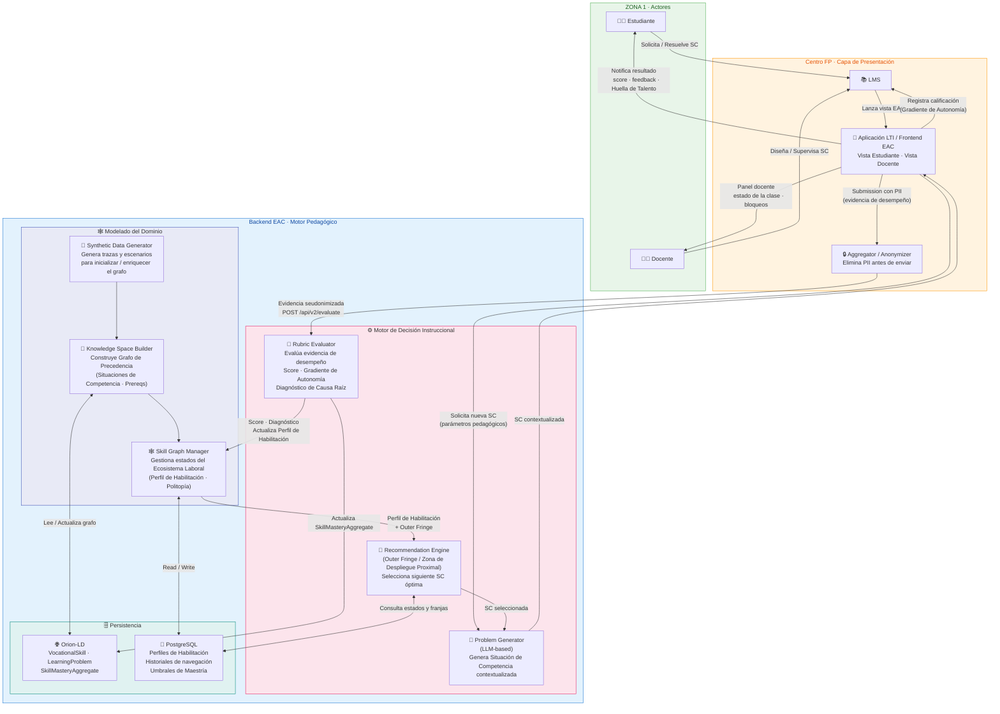

### 5.2 Diagrama de Funcionalidad EAC

```mermaid
graph TB
    subgraph Z1["ZONA 1 · Actores"]
        STUDENT["👨‍🎓 Estudiante"]
        TEACHER["👨‍🏫 Docente"]
    end

    subgraph Z2["Centro FP · Capa de Presentación"]
        LMS["📚 LMS"]
        APP_LTI["📱 Aplicación LTI / Frontend EAC
Vista Estudiante · Vista Docente"]
        ANON["🔒 Aggregator / Anonymizer
Elimina PII antes de enviar"]
    end

    subgraph Z3["Backend EAC · Motor Pedagógico"]

        subgraph GRAPH["🕸️ Modelado del Dominio"]
            KSB["📐 Knowledge Space Builder
Construye Grafo de Precedencia
(Situaciones de Competencia · Prereqs)"]
            SGRAPH["🕸️ Skill Graph Manager
Gestiona estados del Ecosistema Laboral
(Perfil de Habilitación · Politopía)"]
            SYNTH["🔬 Synthetic Data Generator
Genera trazas y escenarios
para inicializar / enriquecer el grafo"]
        end

        subgraph ENGINE["⚙️ Motor de Decisión Instruccional"]
            REC["🎯 Recommendation Engine
(Outer Fringe / Zona de Despliegue Proximal)
Selecciona siguiente SC óptima"]
            PGEN["🤖 Problem Generator
(LLM-based)
Genera Situación de Competencia contextualizada"]
            RUBRIC["📝 Rubric Evaluator
Evalúa evidencia de desempeño
Score · Gradiente de Autonomía
Diagnóstico de Causa Raíz"]
        end

        subgraph DATA["🗄️ Persistencia"]
            ORIONLD["🌐 Orion-LD
VocationalSkill · LearningProblem
SkillMasteryAggregate"]
            POSTGRES_C["🐘 PostgreSQL
Perfiles de Habilitación
Historiales de navegación
Umbrales de Maestría"]
        end
    end

    %% ── Actores → LMS ──
    STUDENT -->|"Solicita / Resuelve SC"| LMS
    TEACHER -->|"Diseña / Supervisa SC"| LMS

    %% ── LMS ↔ APP_LTI ──
    LMS -->|"Lanza vista EAC"| APP_LTI
    APP_LTI -->|"Registra calificación
    (Gradiente de Autonomía)"| LMS

    %% ── APP_LTI → ANON → EAC ──
    APP_LTI -->|"Submission con PII
    (evidencia de desempeño)"| ANON
    ANON -->|"Evidencia seudonimizada
    POST /api/v2/evaluate"| RUBRIC

    %% ── Docente → generación de SC ──
    APP_LTI -->|"Solicita nueva SC
    (parámetros pedagógicos)"| PGEN

    %% ── Motor interno EAC ──
    SYNTH --> KSB
    KSB --> SGRAPH
    SGRAPH -->|"Perfil de Habilitación
    + Outer Fringe"| REC
    REC -->|"SC seleccionada"| PGEN
    PGEN -->|"SC contextualizada"| APP_LTI
    RUBRIC -->|"Score · Diagnóstico
    Actualiza Perfil de Habilitación"| SGRAPH
    RUBRIC -->|"Actualiza SkillMasteryAggregate"| ORIONLD

    %% ── APP_LTI → Estudiante (retorno) ──
    APP_LTI -->|"Notifica resultado
    score · feedback · Huella de Talento"| STUDENT

    %% ── Docente accede a métricas ──
    APP_LTI -->|"Panel docente
    estado de la clase · bloqueos"| TEACHER

    %% ── Persistencia ──
    SGRAPH <-->|"Read / Write"| POSTGRES_C
    REC <-->|"Consulta estados y franjas"| POSTGRES_C
    KSB <-->|"Lee / Actualiza grafo"| ORIONLD

    style Z1 fill:#e8f5e9,stroke:#4caf50,color:#1b5e20
    style Z2 fill:#fff3e0,stroke:#ff9800,color:#e65100
    style Z3 fill:#e3f2fd,stroke:#1976d2,color:#0d47a1
    style GRAPH fill:#e8eaf6,stroke:#3f51b5
    style ENGINE fill:#fce4ec,stroke:#e91e63
    style DATA fill:#e0f2f1,stroke:#00897b
```
