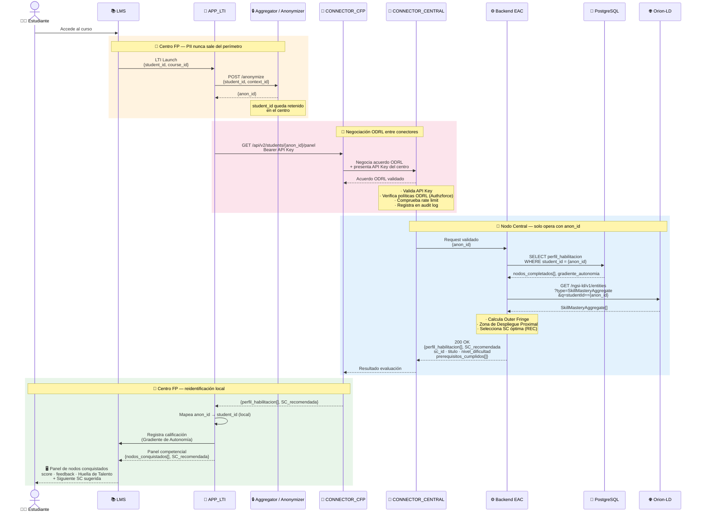
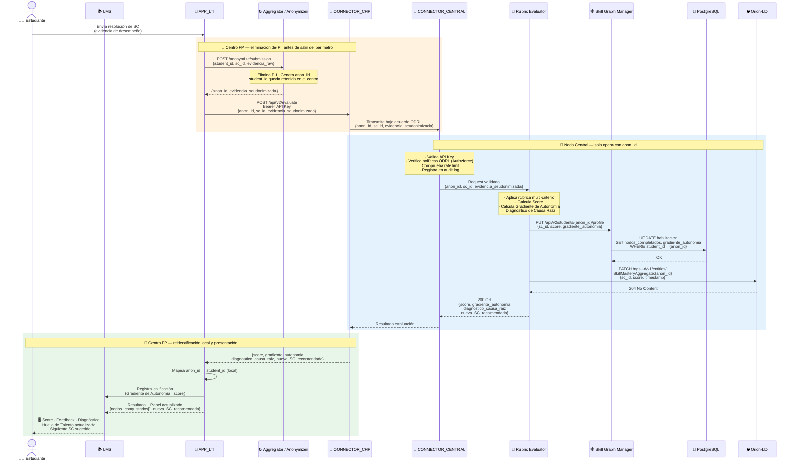
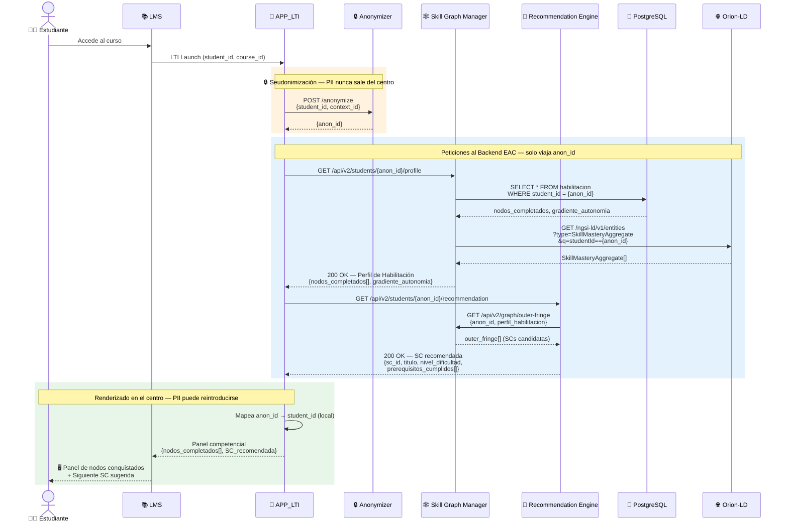

### 5.4 Diagramas de Secuencias

#### 5.4.1 Flujo de Datos Principal

#### 5.4.2 Flujo de Envío de Evidencia

El flujo de **envío de evidencia** (resolución de una SC) sigue el mismo canal en sentido inverso:

---

#### 5.4.3 Diagrama detallado del flujo de recomendación

