### 5.4 Diagramas de Secuencias

#### 5.4.1 Flujo de Datos Principal

```mermaid
sequenceDiagram
    actor STUDENT as 👨‍🎓 Estudiante
    participant LMS as 📚 LMS
    participant APP_LTI as 📱 APP_LTI
    participant ANON as 🔒 Aggregator / Anonymizer
    participant CONNECTOR_CFP as 🔗 CONNECTOR_CFP
    participant CONNECTOR_CENTRAL as 🔗 CONNECTOR_CENTRAL
    participant EAC as ⚙️ Backend EAC
    participant POSTGRES_C as 🐘 PostgreSQL
    participant ORIONLD as 🌐 Orion-LD

    STUDENT->>LMS: Accede al curso

    rect rgb(255, 243, 224)
        Note over LMS,ANON: 🏫 Centro FP — PII nunca sale del perímetro

        LMS->>APP_LTI: LTI Launch<br/>{student_id, course_id}
        APP_LTI->>ANON: POST /anonymize<br/>{student_id, context_id}
        ANON-->>APP_LTI: {anon_id}
        Note over ANON: student_id queda retenido<br/>en el centro
    end

    rect rgb(252, 228, 236)
        Note over CONNECTOR_CFP,CONNECTOR_CENTRAL: 🔗 Negociación ODRL entre conectores

        APP_LTI->>CONNECTOR_CFP: GET /api/v2/students/{anon_id}/panel<br/>Bearer API Key
        CONNECTOR_CFP->>CONNECTOR_CENTRAL: Negocia acuerdo ODRL<br/>+ presenta API Key del centro
        CONNECTOR_CENTRAL-->>CONNECTOR_CFP: Acuerdo ODRL validado
        Note over CONNECTOR_CENTRAL: · Valida API Key<br/>· Verifica políticas ODRL (Authzforce)<br/>· Comprueba rate limit<br/>· Registra en audit log
    end

    rect rgb(227, 242, 253)
        Note over CONNECTOR_CENTRAL,ORIONLD: 🧠 Nodo Central — solo opera con anon_id

        CONNECTOR_CENTRAL->>EAC: Request validado<br/>{anon_id}

        EAC->>POSTGRES_C: SELECT perfil_habilitacion<br/>WHERE student_id = {anon_id}
        POSTGRES_C-->>EAC: nodos_completados[], gradiente_autonomia

        EAC->>ORIONLD: GET /ngsi-ld/v1/entities<br/>?type=SkillMasteryAggregate<br/>&q=studentId=={anon_id}
        ORIONLD-->>EAC: SkillMasteryAggregate[]

        Note over EAC: · Calcula Outer Fringe<br/>· Zona de Despliegue Proximal<br/>· Selecciona SC óptima (REC)

        EAC-->>CONNECTOR_CENTRAL: 200 OK<br/>{perfil_habilitacion[], SC_recomendada<br/>sc_id · titulo · nivel_dificultad<br/>prerequisitos_cumplidos[]}
        CONNECTOR_CENTRAL-->>CONNECTOR_CFP: Resultado evaluación
    end

    rect rgb(232, 245, 233)
        Note over CONNECTOR_CFP,STUDENT: 🏫 Centro FP — reidentificación local

        CONNECTOR_CFP-->>APP_LTI: {perfil_habilitacion[], SC_recomendada}
        APP_LTI->>APP_LTI: Mapea anon_id → student_id (local)
        APP_LTI->>LMS: Registra calificación<br/>(Gradiente de Autonomía)
        APP_LTI-->>LMS: Panel competencial<br/>{nodos_conquistados[], SC_recomendada}
        LMS-->>STUDENT: 🖥️ Panel de nodos conquistados<br/>score · feedback · Huella de Talento<br/>+ Siguiente SC sugerida
    end
```

#### 5.4.2 Flujo de Envío de Evidencia

El flujo de **envío de evidencia** (resolución de una SC) sigue el mismo canal en sentido inverso:

```mermaid
sequenceDiagram
    actor STUDENT as 👨‍🎓 Estudiante
    participant LMS as 📚 LMS
    participant APP_LTI as 📱 APP_LTI
    participant ANON as 🔒 Aggregator / Anonymizer
    participant CONNECTOR_CFP as 🔗 CONNECTOR_CFP
    participant CONNECTOR_CENTRAL as 🔗 CONNECTOR_CENTRAL
    participant RUBRIC as 📝 Rubric Evaluator
    participant SGRAPH as 🕸️ Skill Graph Manager
    participant POSTGRES_C as 🐘 PostgreSQL
    participant ORIONLD as 🌐 Orion-LD

    STUDENT->>APP_LTI: Envía resolución de SC<br/>(evidencia de desempeño)

    rect rgb(255, 243, 224)
        Note over APP_LTI,CONNECTOR_CFP: 🏫 Centro FP — eliminación de PII antes de salir del perímetro

        APP_LTI->>ANON: POST /anonymize/submission<br/>{student_id, sc_id, evidencia_raw}
        Note over ANON: Elimina PII · Genera anon_id<br/>student_id queda retenido en el centro
        ANON-->>APP_LTI: {anon_id, evidencia_seudonimizada}
        APP_LTI->>CONNECTOR_CFP: POST /api/v2/evaluate<br/>Bearer API Key<br/>{anon_id, sc_id, evidencia_seudonimizada}
        CONNECTOR_CFP->>CONNECTOR_CENTRAL: Transmite bajo acuerdo ODRL<br/>{anon_id, sc_id, evidencia_seudonimizada}
    end

    rect rgb(227, 242, 253)
        Note over CONNECTOR_CENTRAL,ORIONLD: 🧠 Nodo Central — solo opera con anon_id

        Note over CONNECTOR_CENTRAL: · Valida API Key<br/>· Verifica políticas ODRL (Authzforce)<br/>· Comprueba rate limit<br/>· Registra en audit log

        CONNECTOR_CENTRAL->>RUBRIC: Request validado<br/>{anon_id, sc_id, evidencia_seudonimizada}

        Note over RUBRIC: · Aplica rúbrica multi-criterio<br/>· Calcula Score<br/>· Calcula Gradiente de Autonomía<br/>· Diagnóstico de Causa Raíz

        RUBRIC->>SGRAPH: PUT /api/v2/students/{anon_id}/profile<br/>{sc_id, score, gradiente_autonomia}
        SGRAPH->>POSTGRES_C: UPDATE habilitacion<br/>SET nodos_completados, gradiente_autonomia<br/>WHERE student_id = {anon_id}
        POSTGRES_C-->>SGRAPH: OK

        RUBRIC->>ORIONLD: PATCH /ngsi-ld/v1/entities/<br/>SkillMasteryAggregate:{anon_id}<br/>{sc_id, score, timestamp}
        ORIONLD-->>RUBRIC: 204 No Content

        RUBRIC-->>CONNECTOR_CENTRAL: 200 OK<br/>{score, gradiente_autonomia<br/>diagnostico_causa_raiz<br/>nueva_SC_recomendada}
        CONNECTOR_CENTRAL-->>CONNECTOR_CFP: Resultado evaluación
    end

    rect rgb(232, 245, 233)
        Note over CONNECTOR_CFP,STUDENT: 🏫 Centro FP — reidentificación local y presentación

        CONNECTOR_CFP-->>APP_LTI: {score, gradiente_autonomia<br/>diagnostico_causa_raiz, nueva_SC_recomendada}
        APP_LTI->>APP_LTI: Mapea anon_id → student_id (local)
        APP_LTI->>LMS: Registra calificación<br/>(Gradiente de Autonomía · score)
        APP_LTI-->>LMS: Resultado + Panel actualizado<br/>{nodos_conquistados[], nueva_SC_recomendada}
        LMS-->>STUDENT: 🖥️ Score · Feedback · Diagnóstico<br/>Huella de Talento actualizada<br/>+ Siguiente SC sugerida
    end
```

---

#### 5.4.3 Diagrama detallado del flujo de recomendación

```mermaid
sequenceDiagram
    actor STUDENT as 👨‍🎓 Estudiante
    participant LMS as 📚 LMS
    participant APP_LTI as 📱 APP_LTI
    participant ANON as 🔒 Anonymizer
    participant SGRAPH as 🕸️ Skill Graph Manager
    participant REC as 🎯 Recommendation Engine
    participant POSTGRES_C as 🐘 PostgreSQL
    participant ORIONLD as 🌐 Orion-LD

    STUDENT->>LMS: Accede al curso
    LMS->>APP_LTI: LTI Launch (student_id, course_id)

    rect rgb(255, 243, 224)
        Note over APP_LTI,ANON: 🔒 Seudonimización — PII nunca sale del centro
        APP_LTI->>ANON: POST /anonymize<br/>{student_id, context_id}
        ANON-->>APP_LTI: {anon_id}
    end

    rect rgb(227, 242, 253)
        Note over APP_LTI,ORIONLD: Peticiones al Backend EAC — solo viaja anon_id

        APP_LTI->>SGRAPH: GET /api/v2/students/{anon_id}/profile
        SGRAPH->>POSTGRES_C: SELECT * FROM habilitacion<br/>WHERE student_id = {anon_id}
        POSTGRES_C-->>SGRAPH: nodos_completados, gradiente_autonomia
        SGRAPH->>ORIONLD: GET /ngsi-ld/v1/entities<br/>?type=SkillMasteryAggregate<br/>&q=studentId=={anon_id}
        ORIONLD-->>SGRAPH: SkillMasteryAggregate[]
        SGRAPH-->>APP_LTI: 200 OK — Perfil de Habilitación<br/>{nodos_completados[], gradiente_autonomia}

        APP_LTI->>REC: GET /api/v2/students/{anon_id}/recommendation
        REC->>SGRAPH: GET /api/v2/graph/outer-fringe<br/>{anon_id, perfil_habilitacion}
        SGRAPH-->>REC: outer_fringe[] (SCs candidatas)
        REC-->>APP_LTI: 200 OK — SC recomendada<br/>{sc_id, titulo, nivel_dificultad,<br/>prerequisitos_cumplidos[]}
    end

    rect rgb(232, 245, 233)
        Note over APP_LTI,STUDENT: Renderizado en el centro — PII puede reintroducirse
        APP_LTI->>APP_LTI: Mapea anon_id → student_id (local)
        APP_LTI-->>LMS: Panel competencial<br/>{nodos_completados[], SC_recomendada}
        LMS-->>STUDENT: 🖥️ Panel de nodos conquistados<br/>+ Siguiente SC sugerida
    end
```

